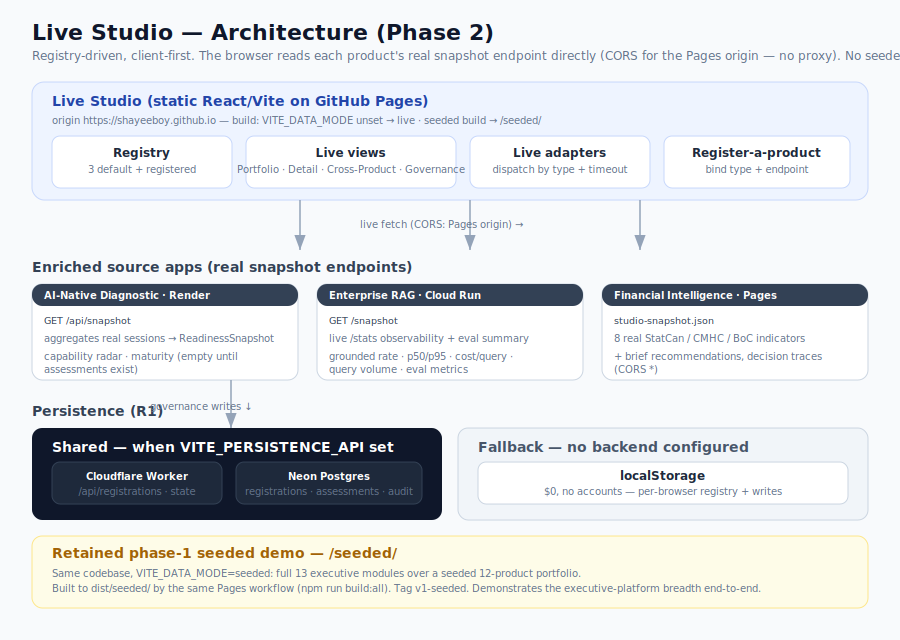
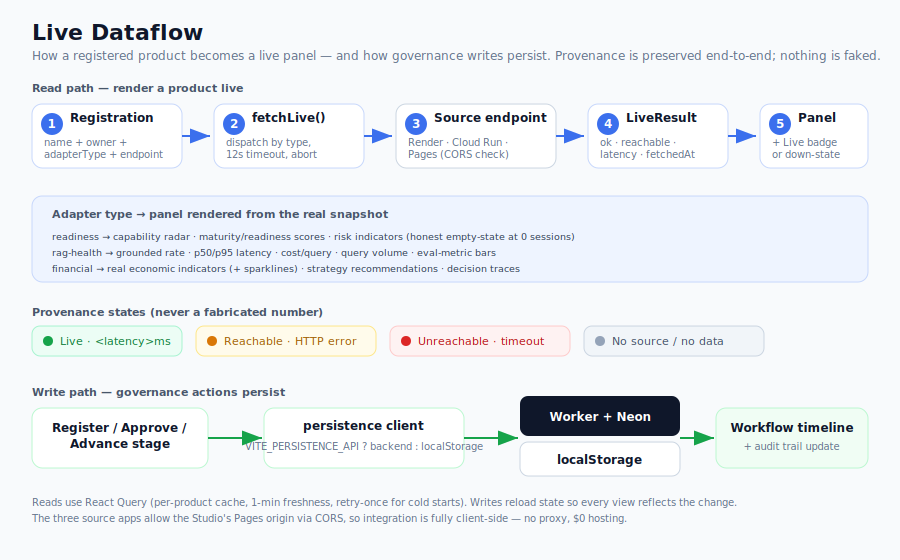
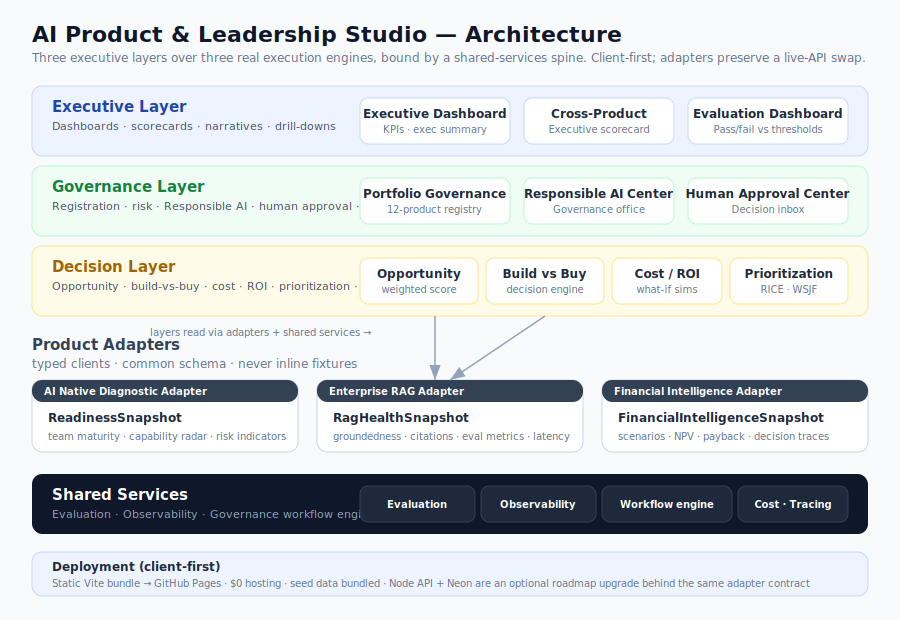
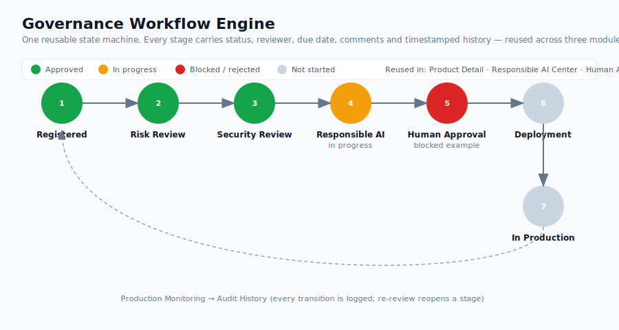

# AI Product and Leadership Studio

> An **executive operating platform** for governing, prioritizing, funding, evaluating and optimizing an enterprise AI **portfolio** — not another AI app, but the layer a Director / VP of AI Product uses to run many AI products at once.

   

The Studio is the fourth member of [**My AI Portfolio**](https://github.com/shayeeboy), whose first three projects are real execution engines — the [AI-Native Diagnostic](https://github.com/shayeeboy/ai-native-diagnostic), [Enterprise RAG Assistant](https://github.com/shayeeboy/Enterprise-RAG-Assistant) and [Financial Intelligence Strategy Agent](https://github.com/shayeeboy/Financial-Intelligence-Strategy-Agent). Rather than rebuild them, the Studio **consumes their outputs** through typed adapters and adds the executive layer they lack: opportunity scoring, build-vs-buy, governance, scorecards, responsible-AI ops, cost/ROI, prioritization and maturity.

---

## See it live

**🎛️ [Live Studio → shayeeboy.github.io/AI-Product-Leadership-Studio](https://shayeeboy.github.io/AI-Product-Leadership-Studio/)** — the registry-driven portfolio, integrated **live** from the three real apps' own snapshot endpoints. No seeded values: a source that's down says so.

**🗂️ [Seeded demo → …/AI-Product-Leadership-Studio/seeded/](https://shayeeboy.github.io/AI-Product-Leadership-Studio/seeded/)** — the retained **phase-1** build: 13 executive modules over a full seeded 12-product portfolio, to demo the executive-platform breadth end-to-end.

Both are static **React 18 / Vite 5** on GitHub Pages, **$0/month**. The live copy fetches
each product's real snapshot directly from the browser (the source apps send CORS for the
Pages origin — no proxy). Free-tier backends can cold-start, so a card may show "checking…"
for a few seconds on first load.

---

## Phase 2 — Live integration (R1 + R2)

The live copy is **registry-driven**: every product is a *registration* (name, owner, adapter
type, and a live snapshot endpoint), and the Studio renders whatever each endpoint returns —
never seeded numbers. The three real apps ship as **default registrations**; a **Register-a-product**
flow adds any future app by pointing at its snapshot endpoint (it enters governance at the
`Registered` stage). The full seeded 13-module Studio is retained separately at [`/seeded/`](https://shayeeboy.github.io/AI-Product-Leadership-Studio/seeded/).

To make the apps *live and rich*, each was enriched to emit a machine-readable snapshot:

| App | Endpoint added | What the Studio renders live |
|---|---|---|
| [AI-Native Diagnostic](https://github.com/shayeeboy/ai-native-diagnostic) | `GET /api/snapshot` — aggregates real `sessions` into a `ReadinessSnapshot` | capability radar, maturity/readiness (honest empty-state until assessments exist) |
| [Enterprise RAG Assistant](https://github.com/shayeeboy/Enterprise-RAG-Assistant) | `GET /snapshot` — live `/stats` observability + eval summary | grounded rate, p50/p95 latency, cost/query, query volume, eval metrics |
| [Financial Intelligence](https://github.com/shayeeboy/Financial-Intelligence-Strategy-Agent) | published `studio-snapshot.json` | 8 real StatCan/CMHC/BoC indicators + strategy recommendations |

**R1 persistence** — registrations, opportunity assessments, workflow state and the audit trail
persist to a **Cloudflare Worker + Neon** backend when `VITE_PERSISTENCE_API` is set (shared across
devices), and to **localStorage** otherwise ($0, no accounts). Deploy runbook: [`docs/PERSISTENCE.md`](docs/PERSISTENCE.md).

Both **R1 and R2 shipped 2026-07-23** — all three source endpoints are deployed and the live copy
is verified pulling real data in production (see [roadmap](#improvement-roadmap)).

### Live architecture



### Live dataflow



---

## Executive summary

| | |
|---|---|
| **Problem** | Enterprises run *many* AI products at once, but the judgment work — which to fund, which to govern, which to kill, what it costs, whether it's safe — happens in scattered decks and spreadsheets. There's no single operating surface for the portfolio. |
| **User** | Senior/Principal PM, Director of Product, Head of AI Product, or AI Strategy leader running an enterprise AI portfolio — plus the governance, finance and risk partners they review with. |
| **Objective** | Demonstrate the *judgment* of an AI product leader: govern, evaluate, fund and scale multiple AI products as one portfolio, with storytelling and decision support on every screen. |
| **Enterprise applicability** | The three-layer model (Executive / Governance / Decision) over adapters + shared services mirrors how a real platform team structures a multi-tenant internal tool. Any real AI product plugs in by exposing one snapshot endpoint and registering it — as the three real apps and the Register-a-product flow demonstrate live. |
| **Success metric** | A reviewer can walk the [demo script](#demo-script) end-to-end and, at each screen, answer *"so what should I decide?"* — with interactive inputs that change outputs, not static mockups. |
| **Acceptance criteria** | All 13 modules live and routable · 3 adapters serving §5 schemas · one governance engine reused in 3 modules · every KPI charted · 3 modules genuinely interactive · Responsible AI Center complete · no inline cross-module data · static build deploys to Pages. Full checklist in [`docs/REVISED-BUILD-BRIEF.md`](docs/REVISED-BUILD-BRIEF.md). |
| **Key trade-off decisions** | See below. |

### Key trade-off decisions

1. **Client-first, not Cloud Run + Neon (phase 1).** The draft brief mandated a Node API + serverless Postgres. For *stable, seeded demo data* that's infrastructure with no payoff — so phase 1 bundled seed data as typed fixtures behind the adapter contract and shipped fully static for **$0**, exactly as the Financial Intelligence project did. Because modules depended on the contract not the source, going live in Phase 2 (R2) *was* a drop-in — **now shipped**. ([why](docs/REVISED-BUILD-BRIEF.md#what-changed-and-why))
2. **Adapter contract is sacred.** `getSnapshot / getHistory / listProducts` return the §5 schemas whether the data comes from a seeded fixture or a live endpoint. Swapping the source touches ~3 files and zero modules — which is exactly why Phase 2 could go live without touching the modules.
3. **Breadth with honest depth.** All 13 seeded routes ship as working screens rather than 5 polished + 8 stubs. Depth is front-loaded on the executive/governance/decision modules that carry the story; Product Discovery uses templated assists (as the brief permits).
4. **HashRouter over a `404.html` hack** for zero-config deep-linking on Pages.
5. **`npm run build` (tsc + vite) is the green-gate now**; component/e2e tests are sequenced as Roadmap R4, not pretended.
6. **Phase 2 pivot — enrich the sources, don't fake them.** Going live meant the source apps only exposed *operational health* (Diagnostic, RAG) + *real economic data* (FI), not rich per-product snapshots. Rather than mix seeded values into a "live" copy, each source app was **enriched to emit a real snapshot endpoint**, and the live copy shows only what those endpoints actually return — with an honest "unreachable / no data" state instead of a fabricated one. The full seeded demo lives on, untouched, at [`/seeded/`](https://shayeeboy.github.io/AI-Product-Leadership-Studio/seeded/).

---

## Run it locally &amp; deploy

- **Local:** `npm install && npm run dev` → the dev server prints a `…/AI-Product-Leadership-Studio/` URL.
- **Hosted (live):** GitHub Pages is enabled (*Settings → Pages → Source: GitHub Actions*); the committed workflow auto-publishes every push to `main` to **[the live site above](https://shayeeboy.github.io/AI-Product-Leadership-Studio/)**.

---

## How it works

- [Architecture](#architecture)
- [The three layers](#the-three-layers)
- [Product adapters](#product-adapters)
- [Governance workflow engine](#governance-workflow-engine)
- [Feature modules](#feature-modules)
- [Run it locally](#run-it-locally)
- [Demo script](#demo-script)

> The sections below describe the **seeded phase-1 build** (the retained [`/seeded/`](https://shayeeboy.github.io/AI-Product-Leadership-Studio/seeded/) demo) — its three-layer model, 13 modules and seeded adapters. The **live copy** is covered in [Phase 2 — Live integration](#phase-2--live-integration-r1--r2) above (registry, live adapters, the enriched source endpoints, and persistence).

### Architecture

Three executive layers sit over the three real execution engines, bound by a shared-services spine. Every module reads **shared services** and **adapters** — never another module's internals (the boundary contract).



### The three layers

- **Executive Layer** — Executive Dashboard, Cross-Product Intelligence, Evaluation Dashboard. Optimized for storytelling and drill-down.
- **Governance Layer** — Portfolio Governance, Responsible AI Center, Human Approval Center. Registration → review → approval → audit.
- **Decision Layer** — Opportunity Assessment, Build vs Buy, Cost Analyzer, ROI Simulator, Investment Prioritization, Maturity Assessment. The analytical engines.
- **Shared Services** — evaluation, observability, the governance workflow engine, tracing and cost, so the app behaves like one platform, not ten screens.

### Product adapters

Each portfolio project is an execution engine behind a thin, typed adapter (`src/adapters/`) that returns a common schema (`src/types/domain.ts`):

| Adapter | Feeds | Contract |
|---|---|---|
| AI Native Diagnostic | Executive Readiness | `ReadinessSnapshot` — maturity, capability radar, risk indicators |
| Enterprise RAG Assistant | Knowledge Health + Evaluation | `RagHealthSnapshot` — groundedness, citations, eval metrics, latency |
| Financial Intelligence | Executive Financial | `FinancialIntelligenceSnapshot` — scenarios, NPV, payback, decision traces |

In the seeded demo these read `src/seed/*`. In the **live copy** the equivalent adapters (`src/live/liveAdapters.ts`) fetch each app's real snapshot endpoint instead — the design goal ("swap the source, not the modules") realized in Phase 2. The live Financial adapter surfaces **real economic indicators** rather than the seeded NPV scenarios, matching what the FI agent actually produces.

### Governance workflow engine

One reusable state machine (`src/shared/governance/`) — `Registered → Risk → Security → Responsible AI → Human Approval → Deployment → In Production` — with per-stage status, reviewer, comment and timestamped history. It is implemented **once** and reused on the Product Detail page, the Responsible AI Center and the Human Approval Center. Approvals in the Approval Center mutate the shared store, which updates every timeline and appends to the audit trail live.



### Feature modules

The **seeded demo** ships all 13 under the app shell:

**Executive** — Executive Dashboard · Cross-Product Intelligence
**Governance** — Portfolio Governance · Responsible AI Center · Human Approval Center · Evaluation Dashboard
**Decision** — Opportunity Assessment · Build vs Buy Advisor · Cost Analyzer · ROI Simulator · Investment Prioritization · Maturity Assessment
**Products** — Product Discovery Workspace (+ Product Detail drill-down)

The interactive ones — Opportunity Assessment, Build vs Buy, Cost Analyzer, ROI Simulator, Investment Prioritization, Maturity — recompute outputs from your inputs live. Opportunity scores flow into Investment Prioritization with no re-entry.

The **live copy** is intentionally leaner — it shows only what the real endpoints support: **Live Portfolio** (status cards), **Product Detail** (a readiness / RAG-health / financial panel driven by the live snapshot), **Register a product**, **Cross-Product Live Scorecard**, and **Governance & Approvals** (persisted workflow + audit).

### Run it locally

```bash
npm install
npm run dev          # dev server with HMR (live copy by default)
npm run build        # tsc typecheck + live app → dist/
npm run build:all    # live app → dist/ AND seeded demo → dist/seeded/  (what CI deploys)
npm run preview      # serve the built bundle
```

No keys or database required. Optional env vars (see [`.env.example`](.env.example)): `VITE_DATA_MODE=seeded`
builds the retained demo; `VITE_PERSISTENCE_API=<worker-url>` switches persistence from localStorage to the
shared Neon backend. Locally, the Diagnostic/RAG panels show "unreachable" because those backends allow only
the `shayeeboy.github.io` origin — they resolve on the deployed site.

### Demo script (live copy)

1. **Live Portfolio** — three registered products, each with a live badge + latency. RAG shows its real grounded rate and query count; Financial Intelligence its real debt-to-income; the Diagnostic an honest "0 assessments recorded" until someone completes one.
2. **Product Detail (Financial Intelligence)** — the real StatCan/BoC indicators with sparklines, the strategy brief's executive summary and recommendations, sourced live.
3. **Product Detail (Enterprise RAG)** — live grounded rate, p50/p95 latency, query volume and the eval-metric bars (pass/fail vs threshold).
4. **Register a product** — point the form at any snapshot endpoint, hit **Test** to check reachability, and register it; it appears on the portfolio and enters governance at "Registered."
5. **Governance & Approvals** — advance a product a stage; the workflow timeline and audit trail update and persist.

### Demo script (seeded demo, `/seeded/`)

1. **Executive Dashboard** — portfolio health *At Risk · 40%*; 10 active products, $45.4K/mo. Read the auto-generated executive summary.
2. **Portfolio Governance** — filter to *Over Budget*; open the risk heatmap; click **Visual QC Inspector** → Product Detail.
3. **Opportunity Assessment** — drag the sliders; the Opportunity Score, recommendation and radar recompute (note the inverse dimensions).
4. **Build vs Buy** — high IP sensitivity + low team maturity → the recommended path flips to RAG/Hybrid with a rationale.
5. **Human Approval Center** — approve the blocked *Sales Outreach Agent* stage → the audit trail updates instantly (shared engine).

---

## Lessons learned

- **The infrastructure the brief asked for wasn't the infrastructure the product needed.** A VP-facing demo over *stable seed data* gains nothing from Cloud Run + Neon and loses the $0/zero-secrets property the rest of the portfolio is known for. The valuable part of the brief's backend story was the **adapter contract**, not the backend — so I kept the contract and dropped the servers.
- **Breadth is a feature for this audience.** A portfolio reviewer clicking into a dead "coming soon" stub reads as *unfinished*; a live-but-simpler screen reads as *scoped*. Shipping all 13 routes, honestly labeled, beat polishing five.
- **A shared state machine is what makes ten screens feel like one platform.** The single moment the app stops looking like a mockup is when an approval in one module visibly changes an audit trail in another. That came from one Zustand store, not from any individual screen.
- **`noUnusedLocals` + `tsc` caught the only real defect** (a stray import) before it ever ran — cheap, high-signal correctness for the time budget.
- **Status vocabulary is a design system.** One `lib/status.ts` map for colors/labels is why the whole portfolio reads as one system across badges, heatmaps and timelines.
- **(Phase 2) The CORS header the source apps already sent for the Pages origin is what made live integration free.** Because the three apps allow `https://shayeeboy.github.io`, the live copy fetches their snapshots straight from the browser — no proxy, no backend, $0. The honest move was to *enrich* the sources to emit real snapshots rather than paper over the gap with seeded numbers; the live UI shows "unreachable" when a free-tier backend is cold rather than inventing data.

## Improvement roadmap

**Shipped**
- **R1 — Persistence backend. ✅ SHIPPED 2026-07-23.** Cloudflare Worker + Neon (`server/`) for the registry, assessments, workflow state and audit trail; localStorage fallback when no backend is configured. Runbook: [`docs/PERSISTENCE.md`](docs/PERSISTENCE.md). *(Backend is deploy-ready; localStorage is the live default until the Worker is deployed.)*
- **R2 — Live engine integration. ✅ SHIPPED 2026-07-23.** Each source app enriched to emit a real snapshot endpoint; the live copy is registry-driven and verified pulling real data in production (RAG 83% grounded / 76 queries, FI 179.55% debt-to-income + 8 indicators, Diagnostic live empty-state). Plus a Register-a-product flow for future apps.

**Near-term**
- **R3 — Code-split** the Recharts-heavy bundle (live ~666 kB, seeded ~737 kB → lazy per route) to cut first-load.
- **R4 — Tests.** Vitest + RTL for the scoring/rollup logic; a Playwright smoke suite over primary nav + one workflow per module.
- **R9 — Refresh cadence.** Scheduled regeneration of the FI `studio-snapshot.json` and RAG `eval/summary.json` so the live snapshots track the latest source data automatically.

**Stretch**
- **R5 — Optional live LLM assist** in Product Discovery (graceful template fallback with no key).
- **R6 — Auth + multi-tenant** portfolios (per-org seed → per-org data).
- **R7 — Export** board-ready PDF/deck from the Executive Dashboard and Cross-Product scorecard.
- **R8 — Real observability** across all products (the RAG panel already shows live traces/latency/cost; extend to the others as their endpoints expose it).

---

## Positioning

This reads as a coherent **AI Product Leadership platform**, not "three AI projects plus a dashboard." The three engines are real and already built; the Studio is the governance, decision and executive layer a Director/VP needs to run all of them — and future products — as a portfolio. It demonstrates product judgment, governance, investment decision-making and executive storytelling, not just implementation.

Build details and the full revised brief: [`docs/PLAN.md`](docs/PLAN.md) · [`docs/REVISED-BUILD-BRIEF.md`](docs/REVISED-BUILD-BRIEF.md).
