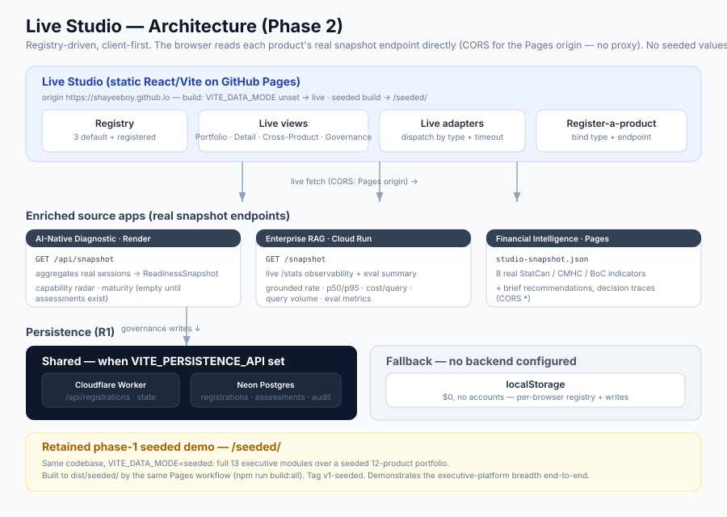
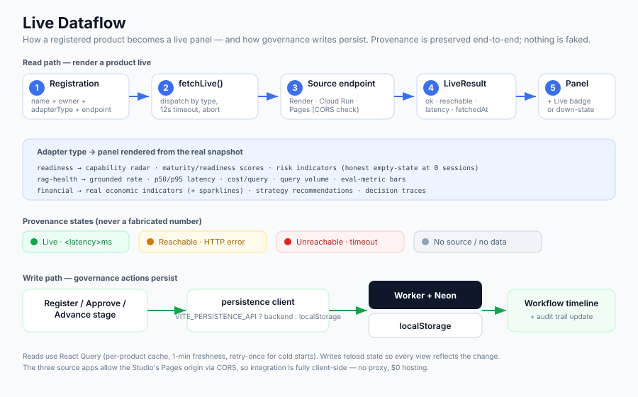
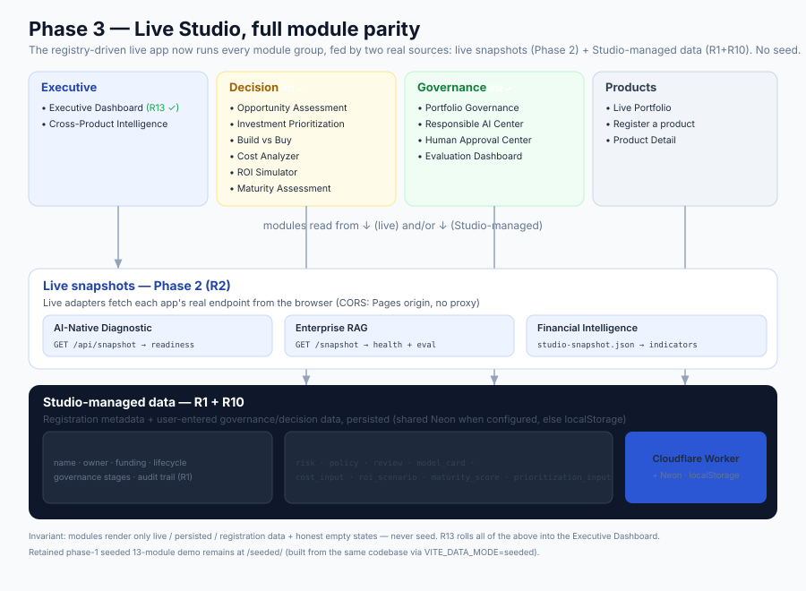
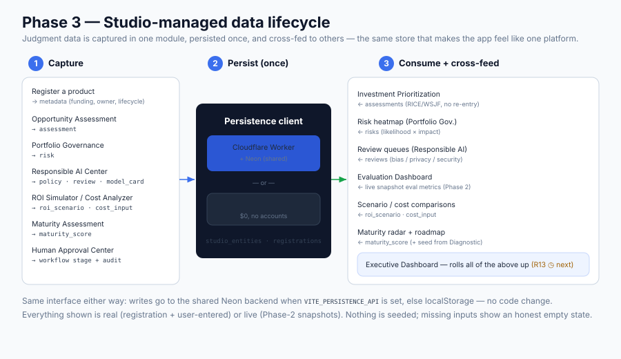
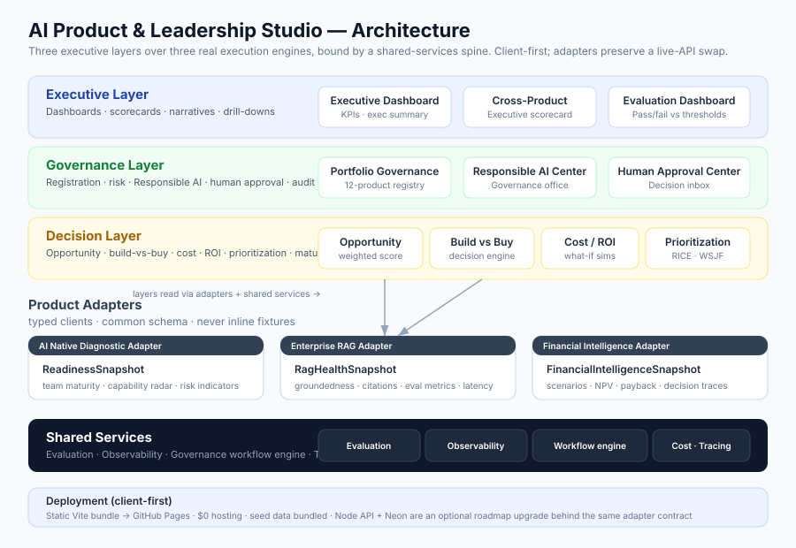
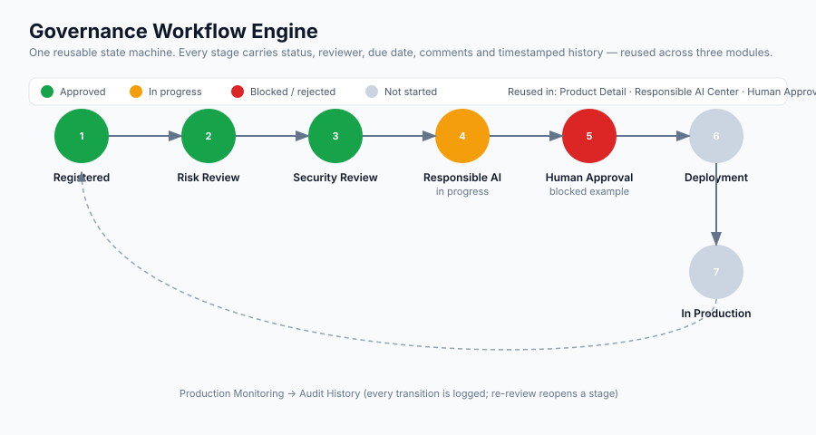

# AI Product and Leadership Studio

> An **executive operating platform** for governing, prioritizing, funding, evaluating and optimizing an enterprise AI **portfolio** — not another AI app, but the layer a Director / VP of AI Product uses to run many AI products at once.

   

The Studio is the fourth member of [**My AI Portfolio**](https://github.com/shayeeboy), whose first three projects are real execution engines — the [AI-Native Diagnostic](https://github.com/shayeeboy/ai-native-diagnostic), [Enterprise RAG Assistant](https://github.com/shayeeboy/Enterprise-RAG-Assistant) and [Financial Intelligence Strategy Agent](https://github.com/shayeeboy/Financial-Intelligence-Strategy-Agent). Rather than rebuild them, the Studio **integrates them live** — reading each app's real snapshot endpoint through typed adapters — and adds the executive layer they lack: opportunity scoring, build-vs-buy, governance, scorecards, responsible-AI ops, cost/ROI, prioritization and maturity.

It got there in three phases, each building on the last without breaking the one before:

- **Phase 1 — seeded platform.** A full **13-module** executive Studio over a seeded 12-product portfolio, shipped static for $0. Retained as a breadth demo at [`/seeded/`](https://shayeeboy.github.io/AI-Product-Leadership-Studio/seeded/).
- **Phase 2 — live integration.** A **registry-driven** live copy that reads each real app's own snapshot endpoint (no seed), with a Register-a-product flow for future apps and optional shared persistence.
- **Phase 3 — full module parity, live.** The decision and governance toolset now runs in the live copy on real, persisted **Studio-managed data** — register → assess → prioritize → govern → evaluate — not seed.

Because every module was written against a stable data *contract*, each phase swapped the source, not the screens. Each phase is made of numbered milestones — **roadmap items** like R1, R2, R10 — introduced in that phase's section below and tracked in full in the [roadmap](#improvement-roadmap).

**Contents:** [See it live](#see-it-live) · [Executive summary](#executive-summary) · [Phase 1 — Seeded platform](#phase-1--seeded-platform) · [Phase 2 — Live integration](#phase-2--live-integration) · [Phase 3 — Full module parity](#phase-3--full-module-parity-live) · [Run it locally](#run-it-locally-and-deploy) · [How it works](#how-it-works) · [Lessons learned](#lessons-learned) · [Roadmap](#improvement-roadmap) · [Positioning](#positioning)

---

## See it live

**🎛️ [Live Studio → shayeeboy.github.io/AI-Product-Leadership-Studio](https://shayeeboy.github.io/AI-Product-Leadership-Studio/)** — the registry-driven portfolio, integrated **live** from the three real apps' own snapshot endpoints. No seeded values: a source that's down says so.

**🗂️ [Seeded demo → …/AI-Product-Leadership-Studio/seeded/](https://shayeeboy.github.io/AI-Product-Leadership-Studio/seeded/)** — the retained **phase-1** build: 13 executive modules over a full seeded 12-product portfolio, to demo the executive-platform breadth end-to-end.

Both are static **React 18 / Vite 5** on GitHub Pages, **$0/month**. The live copy fetches
each product's real snapshot directly from the browser (the source apps send CORS for the
Pages origin — no proxy). Free-tier backends can cold-start, so a card may show "checking…"
for a few seconds on first load.

---

## Executive summary

| | |
|---|---|
| **Problem** | Enterprises run *many* AI products at once, but the judgment work — which to fund, which to govern, which to kill, what it costs, whether it's safe — happens in scattered decks and spreadsheets. There's no single operating surface for the portfolio. |
| **User** | Senior/Principal PM, Director of Product, Head of AI Product, or AI Strategy leader running an enterprise AI portfolio — plus the governance, finance and risk partners they review with. |
| **Objective** | Demonstrate the *judgment* of an AI product leader: govern, evaluate, fund and scale multiple AI products as one portfolio. The **live copy** now does this end-to-end on real data — three shipped apps integrated live, *plus* the decision and governance toolset running on persisted **Studio-managed data** (register → assess → prioritize → govern → evaluate); the **seeded demo** preserves the original 12-product breadth walkthrough. |
| **Enterprise applicability** | The three-layer model (Executive / Governance / Decision) over adapters + shared services mirrors how a real platform team structures a multi-tenant internal tool. Any real AI product plugs in by exposing one snapshot endpoint and registering it; its governance and decision records are then captured and persisted like any enterprise tool — as the live copy now demonstrates end to end. |
| **Success metric** | **Live:** a reviewer sees real data from three shipped AI products, registers a new one against its endpoint, then *works the portfolio* — scores an opportunity that flows into prioritization, logs a risk that lands on the heatmap, saves an ROI scenario — every entry persisted, **none seeded**. **Seeded:** the same reviewer can still walk the original 13-module breadth demo and, at each screen, answer *"so what should I decide?"* |
| **Acceptance criteria** | **Live copy** — three real apps integrated live via their own endpoints · registry + Register-a-product flow · the **Decision** and **Governance** module groups live on persisted Studio-managed data · shared Neon persistence (localStorage fallback) · no seeded values, honest empty states. **Seeded demo** — the original 13 modules routable · one governance engine reused · every KPI charted · Responsible AI Center complete. Both build static and deploy to Pages ($0). Seeded checklist: [`docs/REVISED-BUILD-BRIEF.md`](docs/REVISED-BUILD-BRIEF.md). |
| **Key trade-off decisions** | See below. |

### Key trade-off decisions

1. **Client-first, not Cloud Run + Neon (phase 1).** The draft brief mandated a Node API + serverless Postgres. For *stable, seeded demo data* that's infrastructure with no payoff — so phase 1 bundled seed data as typed fixtures behind the adapter contract and shipped fully static for **$0**, exactly as the Financial Intelligence project did. Because modules depended on the contract not the source, going live in Phase 2 (R2) *was* a drop-in — **now shipped**. ([why](docs/REVISED-BUILD-BRIEF.md#what-changed-and-why))
2. **Adapter contract is sacred.** `getSnapshot / getHistory / listProducts` return the §5 schemas whether the data comes from a seeded fixture or a live endpoint. Swapping the source touches ~3 files and zero modules — which is exactly why Phase 2 could go live without touching the modules.
3. **Breadth with honest depth.** All 13 seeded routes ship as working screens rather than 5 polished + 8 stubs. Depth is front-loaded on the executive/governance/decision modules that carry the story; Product Discovery uses templated assists (as the brief permits).
4. **HashRouter over a `404.html` hack** for zero-config deep-linking on Pages.
5. **`npm run build` (tsc + vite) is the green-gate now**; component/e2e tests are sequenced as Roadmap R4, not pretended.
6. **Phase 2 pivot — enrich the sources, don't fake them.** Going live meant the source apps only exposed *operational health* (Diagnostic, RAG) + *real economic data* (FI), not rich per-product snapshots. Rather than mix seeded values into a "live" copy, each source app was **enriched to emit a real snapshot endpoint**, and the live copy shows only what those endpoints actually return — with an honest "unreachable / no data" state instead of a fabricated one. The full seeded demo lives on, untouched, at [`/seeded/`](https://shayeeboy.github.io/AI-Product-Leadership-Studio/seeded/).
7. **Not doing R14d (real usage/adoption/billing telemetry) — deliberately, on payoff grounds.** The remaining "Not reported" tiles (adoption, cloud spend) would need the three apps to expose usage/billing endpoints or a cloud-billing integration. But they all run on **free tiers** (Groq $0/query, low traffic), so the *real* numbers would be **≈ zero** — genuine, but not informative, and the only way to make them look like an enterprise portfolio would be to fabricate them, which this project refuses to do everywhere else. So R14 was scoped to what adds *real* signal — the **dependency graph** (R14a) and **live reliability + inference cost** from data the snapshots already expose (R14b/c) — and R14d is left as a documented "wire it up if a product ever has real billing/usage" item. Better an honest "Not reported" than an impressive lie.

---

## Phase 1 — Seeded platform

The first build was the whole executive Studio over a **seeded** 12-product portfolio — all 13
modules, the three-layer model (Executive / Governance / Decision), one reusable governance workflow
engine, and typed adapters reading seed fixtures — shipped as a static bundle to GitHub Pages for
**$0**. The point was to prove the *judgment* (the modules and how they interlock) against stable
data, so the later phases could swap in real, live sources **without touching the screens**.

It's retained, untouched, at [`/seeded/`](https://shayeeboy.github.io/AI-Product-Leadership-Studio/seeded/)
as a breadth demo, and its architecture is the blueprint the live copy grew into — walked through in
[How it works](#how-it-works).

---

## Phase 2 — Live integration

Phase 2 (**R2** + **R1**) makes the Studio *live*. The live copy is **registry-driven**: every product is a *registration* (name, owner, adapter
type, and a live snapshot endpoint), and the Studio renders whatever each endpoint returns —
never seeded numbers. The three real apps ship as **default registrations**; a **Register-a-product**
flow adds any future app by pointing at its snapshot endpoint (it enters governance at the
`Registered` stage). The full seeded 13-module Studio is retained separately at [`/seeded/`](https://shayeeboy.github.io/AI-Product-Leadership-Studio/seeded/).

To make the apps *live and rich*, each was enriched to emit a machine-readable snapshot:

| App | Endpoint added | What the Studio renders live |
|---|---|---|
| [AI-Native Diagnostic](https://github.com/shayeeboy/ai-native-diagnostic) | `GET /api/snapshot` — aggregates real `sessions` into a `ReadinessSnapshot` | capability radar, maturity/readiness (honest empty-state until assessments exist) |
| [Enterprise RAG Assistant](https://github.com/shayeeboy/Enterprise-RAG-Assistant) | `GET /snapshot` — live `/stats` observability + eval summary | grounded rate, p50/p95 latency, cost/query, query volume, eval metrics |
| [Financial Intelligence](https://github.com/shayeeboy/Financial-Intelligence-Strategy-Agent) | published `studio-snapshot.json` | 8 real StatCan/CMHC/BoC indicators + strategy recommendations |

**R1 persistence** — registrations, opportunity assessments, workflow state and the audit trail
persist to a **Cloudflare Worker + Neon** backend when `VITE_PERSISTENCE_API` is set (shared across
devices), and to **localStorage** otherwise ($0, no accounts). The backend is **deployed and the live
site uses it** (shared Neon persistence); deploy runbook: [`docs/PERSISTENCE.md`](docs/PERSISTENCE.md).

**R2 shipped 2026-07-23; R1 deployed 2026-07-24** — all three source endpoints are live and the
Studio is verified pulling real data (and persisting writes) in production (see [roadmap](#improvement-roadmap)).

### Live architecture



### Live dataflow



---

## Phase 3 — Full module parity, live

Phase 3 (**R10–R14**) is the push to full parity. Phase 2 made the live copy *real* but *lean* — a portfolio of live products plus a few governance
screens. Phase 3 brings the **whole executive toolset** into the live copy, on one principle:
everything a module shows must be **real** — either live from a source (Phase 2) or **Studio-managed**
data you enter and it persists. No seed, ever; a missing input shows an honest empty state.

- **R10 — data-model foundation.** Registrations gained funding / lifecycle / ROI metadata, and a
  single generic `studio_entities` table now backs **eight** kinds of governance/decision data
  (risks, policies, reviews, model cards, cost inputs, ROI scenarios, maturity scores, prioritization
  inputs) — persisted to shared Neon when configured, else localStorage. Adding a kind needs no migration.
- **R11 — decision modules live.** Opportunity Assessment → Investment Prioritization (scores flow
  through, no re-entry), ROI Simulator (saved scenarios), Cost Analyzer (anchored on a product's real
  live cost/query), Build vs Buy, and Maturity Assessment (seedable from the Diagnostic's live readiness).
- **R12 — governance modules live.** Portfolio Governance (a real risk register driving the
  likelihood×impact heatmap + funding from registration), Responsible AI Center (policies,
  bias/privacy/security review queues, model cards, live audit trail), and a generalized Evaluation Dashboard.
- **R13 — executive roll-ups live.** The **Executive Dashboard** computes every KPI live from the
  registry, live snapshots and persisted data (open risks, pending governance, opportunities scored,
  live eval pass-rate, spend + ROI target) — each tile a real rollup or an explicit **"Not reported,"**
  never a seeded number — plus an auto-generated executive summary; **Cross-Product Intelligence**
  gains opportunity-score / open-risk columns and business-unit segmentation.
- **R5 — Product Discovery live.** The discovery workspace runs keyless (templated) with an
  **optional live LLM assist** that degrades gracefully to templates — the key stays server-side on
  the Worker's `/api/assist` route.
- **R14a–c — dependency graph + live reliability/cost.** Portfolio Governance carries a persisted
  **product dependency graph**, and the Executive Dashboard shows **live reliability (p95) + inference
  cost** where a snapshot exposes them, "Not reported" otherwise.

The live app now carries the seeded app's **left-rail shell** and its full module set across four
groups — **Executive · Decision · Governance · Products** — matching the seeded 13-module breadth.
Only real usage/adoption/billing **telemetry (R14d)** remains — a deliberate deferral (see [trade-off #7](#key-trade-off-decisions)).

### Phase 3 architecture



### Phase 3 — Studio-managed data lifecycle



---

## Run it locally and deploy

```bash
npm install
npm run dev          # dev server with HMR (live copy by default)
npm run build        # tsc typecheck + live app → dist/
npm run build:all    # live app → dist/ AND seeded demo → dist/seeded/  (what CI deploys)
npm run preview      # serve the built bundle
```

No keys or database required. Optional env vars (see [`.env.example`](.env.example)): `VITE_DATA_MODE=seeded`
builds the retained demo; `VITE_PERSISTENCE_API=<worker-url>` switches persistence from localStorage to the
shared Neon backend. Locally, the Diagnostic/RAG panels show "unreachable" because those backends allow only
the `shayeeboy.github.io` origin — they resolve on the deployed site.

**Hosted (live):** GitHub Pages is enabled (*Settings → Pages → Source: GitHub Actions*); the committed
workflow auto-publishes every push to `main` to **[the live site above](https://shayeeboy.github.io/AI-Product-Leadership-Studio/)**.

---

## How it works

- [Architecture](#architecture)
- [The three layers](#the-three-layers)
- [Product adapters](#product-adapters)
- [Governance workflow engine](#governance-workflow-engine)
- [Feature modules](#feature-modules)
- [Demo scripts](#demo-script-live-copy)

> The sections below document the **seeded phase-1 build** (the retained [`/seeded/`](https://shayeeboy.github.io/AI-Product-Leadership-Studio/seeded/) demo) — its three-layer model, 13 modules and seeded adapters, which are the *architectural blueprint* the live copy later grew into. The **live copy's** evolution is covered above: [Phase 2](#phase-2--live-integration) (registry, live adapters, enriched endpoints, persistence) and [Phase 3](#phase-3--full-module-parity-live) (the full decision + governance module set on Studio-managed data).

### Architecture

Three executive layers sit over the three real execution engines, bound by a shared-services spine. Every module reads **shared services** and **adapters** — never another module's internals (the boundary contract).



### The three layers

- **Executive Layer** — Executive Dashboard, Cross-Product Intelligence, Evaluation Dashboard. Optimized for storytelling and drill-down.
- **Governance Layer** — Portfolio Governance, Responsible AI Center, Human Approval Center. Registration → review → approval → audit.
- **Decision Layer** — Opportunity Assessment, Build vs Buy, Cost Analyzer, ROI Simulator, Investment Prioritization, Maturity Assessment. The analytical engines.
- **Shared Services** — evaluation, observability, the governance workflow engine, tracing and cost, so the app behaves like one platform, not ten screens.

### Product adapters

Each portfolio project is an execution engine behind a thin, typed adapter (`src/adapters/`) that returns a common schema (`src/types/domain.ts`):

| Adapter | Feeds | Contract |
|---|---|---|
| AI Native Diagnostic | Executive Readiness | `ReadinessSnapshot` — maturity, capability radar, risk indicators |
| Enterprise RAG Assistant | Knowledge Health + Evaluation | `RagHealthSnapshot` — groundedness, citations, eval metrics, latency |
| Financial Intelligence | Executive Financial | `FinancialIntelligenceSnapshot` — scenarios, NPV, payback, decision traces |

In the seeded demo these read `src/seed/*`. In the **live copy** the equivalent adapters (`src/live/liveAdapters.ts`) fetch each app's real snapshot endpoint instead — the design goal ("swap the source, not the modules") realized in Phase 2. The live Financial adapter surfaces **real economic indicators** rather than the seeded NPV scenarios, matching what the FI agent actually produces.

### Governance workflow engine

One reusable state machine (`src/shared/governance/`) — `Registered → Risk → Security → Responsible AI → Human Approval → Deployment → In Production` — with per-stage status, reviewer, comment and timestamped history. It is implemented **once** and reused on the Product Detail page, the Responsible AI Center and the Human Approval Center. Approvals in the Approval Center mutate the shared store, which updates every timeline and appends to the audit trail live.



### Feature modules

The **seeded demo** ships all 13 under the app shell:

**Executive** — Executive Dashboard · Cross-Product Intelligence
**Governance** — Portfolio Governance · Responsible AI Center · Human Approval Center · Evaluation Dashboard
**Decision** — Opportunity Assessment · Build vs Buy Advisor · Cost Analyzer · ROI Simulator · Investment Prioritization · Maturity Assessment
**Products** — Product Discovery Workspace (+ Product Detail drill-down)

The interactive ones — Opportunity Assessment, Build vs Buy, Cost Analyzer, ROI Simulator, Investment Prioritization, Maturity — recompute outputs from your inputs live. Opportunity scores flow into Investment Prioritization with no re-entry.

The **live copy**, through Phase 3, now carries the same groups on the left-rail shell — **Executive** (Executive Dashboard, Cross-Product Intelligence), the full **Decision** group (Opportunity Assessment, Investment Prioritization, Build vs Buy, Cost Analyzer, ROI Simulator, Maturity Assessment), **Governance** group (Portfolio Governance, Responsible AI Center, Human Approval Center, Evaluation Dashboard) and **Products** (Live Portfolio, Product Discovery, Register) — all on live + persisted Studio-managed data. It now **matches the seeded 13-module breadth**, and Portfolio Governance carries the **dependency graph** (R14a) with **live reliability + inference cost** on the Executive Dashboard (R14b/c). Only real usage/adoption/billing telemetry (R14d) is deferred. See the [Phase 3 architecture + workflow diagrams](#phase-3--full-module-parity-live).

### Demo script (live copy)

1. **Executive Dashboard** (`/executive`) — the front door: KPIs rolled up live from the registry, live snapshots and your persisted data (reachable products, open risks, opportunities scored, live eval pass-rate). Note the honest **"Not reported"** tiles where there's no source — never a seeded number.
2. **Live Portfolio → Product Detail** — open **Enterprise RAG** for its live grounded rate, p50/p95 latency and eval-metric bars; **Financial Intelligence** for the real StatCan/BoC indicators + strategy brief; the **Diagnostic's** honest "0 assessments" empty-state.
3. **Opportunity Assessment → Investment Prioritization** — score an opportunity and **Save** it, then open Prioritization and watch it appear as a ranked RICE candidate — persisted, no re-entry.
4. **Portfolio Governance → Responsible AI Center** — log a risk; the likelihood×impact **heatmap** updates and the Executive Dashboard's "open risks" ticks up. The RAI Center shows the review queues + model cards.
5. **Product Discovery** — describe a user + problem and hit **Generate**; the **"AI assist (live)"** badge returns a real LLM problem statement (and degrades to a template if the LLM is unavailable), then "Score this in Opportunity Assessment."
6. **Register a product** — point the form at any snapshot endpoint, **Test** reachability, and register it; it joins the portfolio and enters governance at "Registered."

### Demo script (seeded demo, `/seeded/`)

1. **Executive Dashboard** — portfolio health *At Risk · 40%*; 10 active products, $45.4K/mo. Read the auto-generated executive summary.
2. **Portfolio Governance** — filter to *Over Budget*; open the risk heatmap; click **Visual QC Inspector** → Product Detail.
3. **Opportunity Assessment** — drag the sliders; the Opportunity Score, recommendation and radar recompute (note the inverse dimensions).
4. **Build vs Buy** — high IP sensitivity + low team maturity → the recommended path flips to RAG/Hybrid with a rationale.
5. **Human Approval Center** — approve the blocked *Sales Outreach Agent* stage → the audit trail updates instantly (shared engine).

---

## Lessons learned

- **Match the infrastructure to the phase, not the brief.** Phase 1 — a demo over *stable seed data* — gained nothing from the brief's mandated Cloud Run + Neon, so it shipped fully static for $0 behind the adapter contract. Phase 2 — going live — then added exactly the infrastructure that earns its place (a real snapshot endpoint on each app + an optional Neon persistence Worker) **without touching a single module**, because the contract held. The lesson: let the contract absorb the change, and add servers only when the product actually needs them.
- **Breadth is a feature for this audience.** A portfolio reviewer clicking into a dead "coming soon" stub reads as *unfinished*; a live-but-simpler screen reads as *scoped*. Shipping all 13 routes, honestly labeled, beat polishing five.
- **A shared state machine is what makes ten screens feel like one platform.** The single moment the app stops looking like a mockup is when an approval in one module visibly changes an audit trail in another. That came from one Zustand store, not from any individual screen.
- **`noUnusedLocals` + `tsc` caught the only real defect** (a stray import) before it ever ran — cheap, high-signal correctness for the time budget.
- **Status vocabulary is a design system.** One `lib/status.ts` map for colors/labels is why the whole portfolio reads as one system across badges, heatmaps and timelines.
- **(Phase 2) The CORS header the source apps already sent for the Pages origin is what made live integration free.** Because the three apps allow `https://shayeeboy.github.io`, the live copy fetches their snapshots straight from the browser — no proxy, no backend, $0. The honest move was to *enrich* the sources to emit real snapshots rather than paper over the gap with seeded numbers; the live UI shows "unreachable" when a free-tier backend is cold rather than inventing data.
- **(Phase 3) "No seed" is a forcing function that makes a better product.** Bringing modules live on Studio-managed data meant every screen had to earn its numbers from real input or a live source — which turned vague seeded dashboards into honest, interactive tools: enter a risk and the heatmap moves; score an opportunity and it ranks in prioritization; save an ROI scenario and it compares. Empty states became a feature, not a gap. And one generic `studio_entities` table (add a kind, no migration) kept the whole phase frontend-only on the R1/R10 backend.

## Improvement roadmap

**Shipped**
- **R1 — Persistence backend. ✅ SHIPPED 2026-07-23 · DEPLOYED 2026-07-24.** Cloudflare Worker + Neon (`server/`) for the registry, assessments, workflow state and audit trail; localStorage fallback when no backend is configured. The Worker is live and the deployed site now uses **shared Neon persistence** (write round-trip verified). Runbook: [`docs/PERSISTENCE.md`](docs/PERSISTENCE.md).
- **R2 — Live engine integration. ✅ SHIPPED 2026-07-23.** Each source app enriched to emit a real snapshot endpoint; the live copy is registry-driven and verified pulling real data in production (RAG 83% grounded / 76 queries, FI 179.55% debt-to-income + 8 indicators, Diagnostic live empty-state). Plus a Register-a-product flow for future apps.
- **R10 — Data-model foundation (Phase 3). ✅ SHIPPED 2026-07-31.** Extended registration metadata (lifecycle, budget, spend, ROI target) + a generic `studio_entities` table backing all eight Studio-managed entity kinds (risks, policies, reviews, model cards, cost inputs, ROI scenarios, maturity scores, prioritization inputs) — adding a kind needs no migration. Worker entity CRUD + `/api/state` grouping; client `saveEntity`/`deleteEntity` with localStorage fallback; backend-row camelCase normalization. Verified round-tripping against Neon. Prerequisite for R11–R13.
- **R11 — Decision modules live (Phase 3A). ✅ SHIPPED 2026-07-31.** The six decision modules now run in the live copy on Studio-managed data: **Opportunity Assessment** (persists to `/api/assessments`) → **Investment Prioritization** (RICE / WSJF / Value-Effort / Opportunity from persisted assessments; effort persisted as `prioritization_input`), **ROI Simulator** (saved `roi_scenario` entities), **Cost Analyzer** (inference line anchored on a product's real live cost/query), **Build vs Buy** (seed-free calculator, reused), **Maturity Assessment** (persisted `maturity_score`, seedable from the Diagnostic's live readiness). The live app adopts the seeded **left-rail shell**. Frontend-only — no backend redeploy (uses the R1/R10 endpoints).
- **R12 — Governance modules live (Phase 3B). ✅ SHIPPED 2026-07-31.** **Portfolio Governance** (registry + funding/owner/sponsor from registration metadata + a **real risk register** you enter → likelihood×impact heatmap), **Responsible AI Center** (persisted policies, bias/privacy/security review queues, model cards auto-seedable from the registry, + the live audit trail), and a **generalized Evaluation Dashboard** (per-product live eval metrics wherever a snapshot exposes them, honest "unreachable / no metrics" otherwise). Dependency graph deferred to R14. Frontend-only — no backend redeploy.
- **R13 — Executive rollups live (Phase 3C). ✅ SHIPPED 2026-07-31 — Phase 3 module parity complete.** **Executive Dashboard** with KPIs computed live from the registry, live snapshots (`useQueries` across products) and persisted governance/decision data — registered/reachable products, open risks, pending governance, opportunities scored, live eval pass-rate, spend + ROI-target from registration — each tile a real rollup or an explicit **"Not reported"** (never a seeded KPI); auto-generated executive summary + top-opportunity chart. **Cross-Product Intelligence** extended with opportunity-score + open-risk columns and business-unit segmentation. Nav reorganized into **Executive · Decision · Governance · Products**. Frontend-only.
- **R5 — Product Discovery live + optional LLM assist. ✅ SHIPPED 2026-07-31 — full module parity.** The templated Product Discovery workspace now runs in the live copy (keyless, $0), with an **optional live LLM assist**: the client calls the Worker's `POST /api/assist` when configured (the LLM key stays server-side) and **degrades gracefully to templates** on absence or error. Enabled via an `ASSIST_API_KEY` secret + a Worker redeploy (see [`docs/PERSISTENCE.md`](docs/PERSISTENCE.md)) — **now live** on the deployed site (Groq free tier); anyone forking runs keyless (templated) until they add their own key. **The live copy now matches the seeded 13-module breadth.**
- **R14a–c — Dependency graph + live reliability/cost. ✅ SHIPPED 2026-08-01.** **Portfolio Governance** now has a persisted **product dependency graph** (`dependency` entity → an SVG "product → shared infra / model / product" view). The **Executive Dashboard** gains a **live inference-cost** rollup (cost/query × query volume) and **avg p95 latency** reliability, plus a p95 column in the products table — real where a snapshot exposes it, honest "Not reported" otherwise. Frontend-only apart from a one-line Worker allowlist add (`dependency`) → a small redeploy. Only R14d (real usage/adoption/billing telemetry) remains — deliberately deferred (see [trade-off #7](#key-trade-off-decisions)).
- **R3 — Code-split the Recharts-heavy bundle. ✅ SHIPPED 2026-08-02.** Every route in both the live and seeded apps is now `React.lazy` + `Suspense`, the two data-mode roots are lazily imported in `main.tsx` (each build only ships the tree it renders), and Recharts is pinned to one cacheable `manualChunks` vendor chunk. The live app's chart-free landing route now boots on **~98 kB (≈32 kB gzip) instead of a single 772 kB bundle** — Recharts (576 kB) and each module load on demand at navigation.

**Near-term**
- **R4 — Tests.** Vitest + RTL for the scoring/rollup logic; a Playwright smoke suite over primary nav + one workflow per module.
- **R9 — Refresh cadence.** Scheduled regeneration of the FI `studio-snapshot.json` and RAG `eval/summary.json` so the live snapshots track the latest source data automatically.

> **Phase 3 module parity is complete** — R10–R13, R5 and R14a–c are shipped (above), so the live copy fully matches the seeded 13-module breadth, including the dependency graph and live reliability/cost. Full plan: [`docs/PHASE-3-PLAN.md`](docs/PHASE-3-PLAN.md).

**Stretch**
- **R6 — Auth + user management + multi-tenant.** Real sign-in and per-user identity (governance actions currently attribute to a lightweight device-local **"Acting as"** name, default *You* — set in the top bar), plus role-based approvals (who may approve which stage) and per-org portfolios (per-org data).
- **R7 — Export** board-ready PDF/deck from the Executive Dashboard and Cross-Product scorecard.
- **R8 — Real observability** across all products (the RAG panel already shows live traces/latency/cost; extend to the others as their endpoints expose it).
- **R14d — Real usage/adoption/billing telemetry (deferred, deliberately).** The last "Not reported" tiles (adoption, cloud spend) would need the apps to expose usage/billing endpoints or a cloud-billing integration; on free tiers the real numbers are ≈ zero, so this is left as a "wire it up when a product has real billing/usage" item rather than fabricated. *(R14a–c — dependency graph + live reliability/cost — shipped; see above and [trade-off #7](#key-trade-off-decisions).)*

---

## Positioning

This reads as a coherent **AI Product Leadership platform**, not "three AI projects plus a dashboard." The three engines are real, shipped, and now **integrated live**. Over three phases the Studio grew from a seeded breadth demo (P1) to a registry-driven live platform (P2) to one where the decision and governance work itself runs on real, persisted data (P3) — the Studio reads each app's real snapshot endpoint and adds the governance, decision and executive layer a Director/VP needs to run all of them (and future products, via Register-a-product) as a portfolio. It demonstrates product judgment, governance, investment decision-making and executive storytelling — end to end, on real data — not just implementation.

Build details and the full revised brief: [`docs/PLAN.md`](docs/PLAN.md) · [`docs/REVISED-BUILD-BRIEF.md`](docs/REVISED-BUILD-BRIEF.md).
